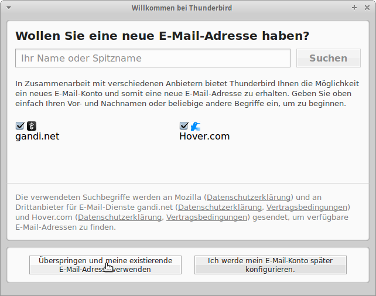
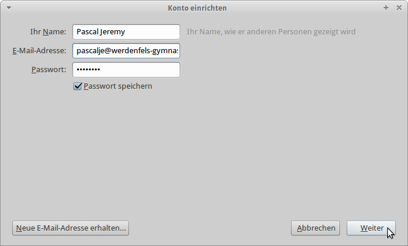
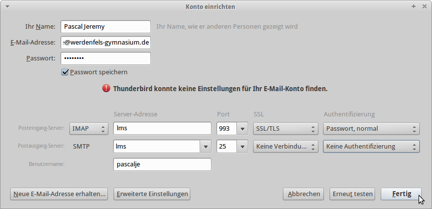
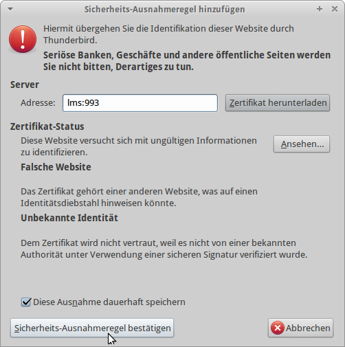
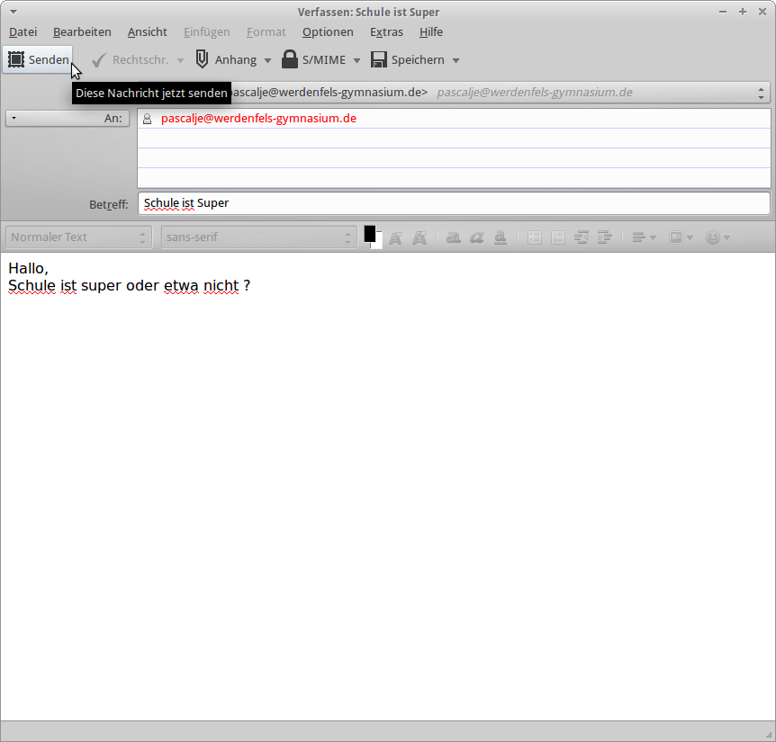

@title Account einrichten
@group thunderbird

1. Öffne Thunderbird

  

2. Klicke auf `Überspringen` und `Meine existierende eMail-Adresse verwenden`

  

3. Zuerst muss man einen Absendernamen eingeben, dann gibt man die eMail-Adresse der Schule ein, diese ist wie gefolgt aufgebaut: `Username@werdenfels-gymnasium.de`

  

4. Übertrage die manuellen Einstellungen, welche in dem oberen Bild zu sehen sind. Danach klicke auf `Fertig`. Nun akzeptiere die kommende Risiken-Meldung

  

5. Akzeptiere die Sicherheits-Ausnahmeregel um fortzufahren.

6. Wenn getestet werden soll, ob die Einrichtung erfolgreich war, dann klicke links oben auf `Verfassen`

  

7. Gib die Empfängeradresse, den Betreff, und die Nachricht ein und klicke auf `Senden`. Nun ist alles Erfolgreich eingerichtet