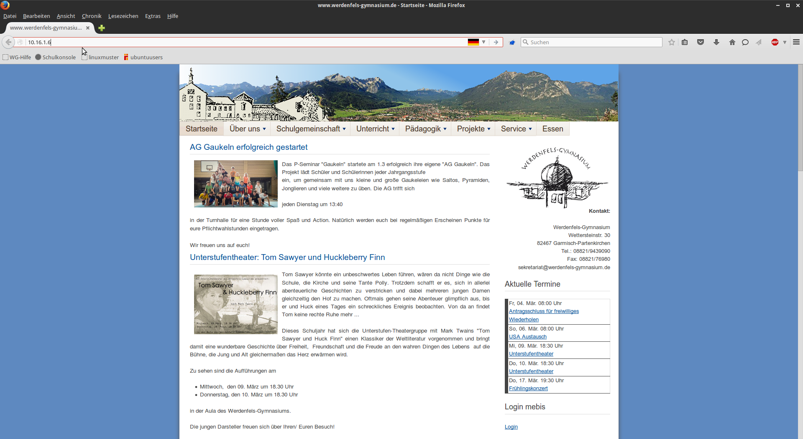
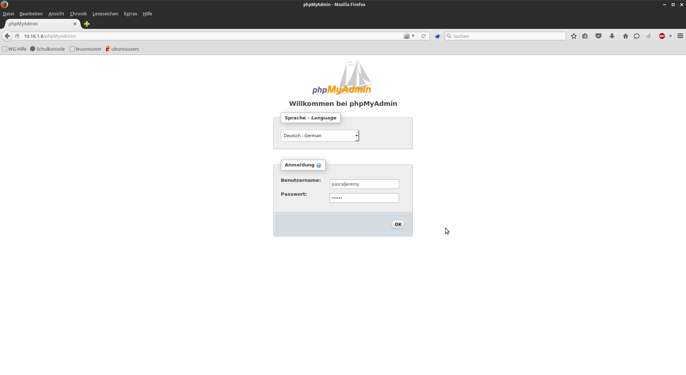

@title MySQL-Browser
@group mysql

1. Öffne den Browser

2. Gib nun die URL `10.16.1.6` ein 

   

3. Gib jetzt Benutzernamen und Passwort ein und drücke auf `OK`

   

4. Nun kann wie gewohnt mit der Datenbank gearbeitet werden