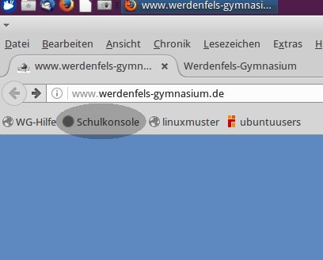
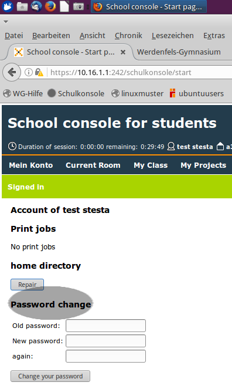
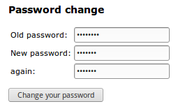

@title Schulpasswort ändern
@group Schulkonsole

<b>Wie ändere ich mein Passwort?<b>

1. Gehe auf http://www.werdenfels-gymnasium.de/

2. Klicke auf "Schulkonsole"

3. Melde dich mit deinem Nutzernamen und Passwort an

4. Nun sieht man schon die große Schrift "Password change"

   Nachdem man in der ersten Zeile sein derzeitiges Passwort eingegeben hat,
   kann man in den unteren zwei Zeilen je einmal das neue Passwort eingeben.

5. Nach einem Klick auf "Change your password" wird das Passwort geändert
   Du wirst mit "Password succesfully changed" benachrichtigt, wenn es
   funktioniert hat

