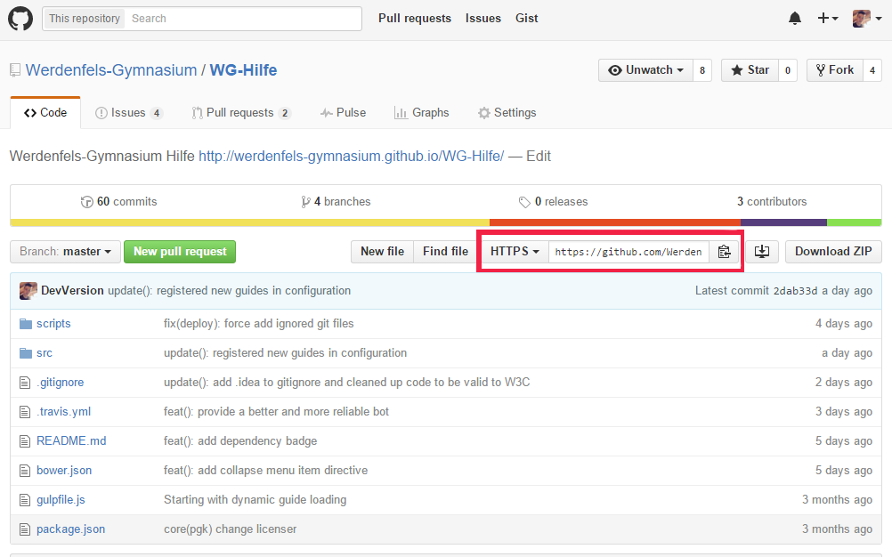

@title Github Klonen
@group github

1. Navigiere in das Verzeichnis in dem du das Github-Projekt abspeichern willst

2. Kopiere nun die URL der Projektseite neben dem HTTPS-Text 

    

3. Öffne jetzt das Terminal in dem gewünschten Verzeichnis 

4. Gib `git clone [URL der Projektseite]` ein

5. Jetzt kannst du mit dem Projekt in dem Verzeichnis arbeiten
