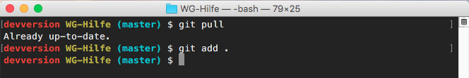
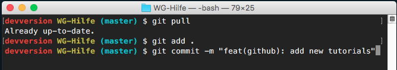
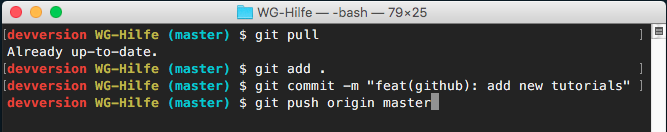

@title Github beisteuern
@group github

1. Öffne das Terminal in dem Projektordner

2. Gib `git pull` ein um alle Veränderungen des Projektes herunterzuladen

    

3. Jetzt sind die Ordner veränderbar

4. Wenn alle Veränderungen gemacht und abgespeichert wurden, gib `git add .` in das Terminal ein um deine Veränderungen zum Source Control Management hinzuzufügen

    

5. Nun müssen die Änderungen mit dem Befehl `git commit -m [Nachricht]` commited (gespeichert) werden, benutze hierfür eine passende Nachricht wie diese: http://goo.gl/U2hMgE
    
    

6. Gib jetzt `git push [REMOTE-NAME] [BRANCH]` ein, damit das Ganze hochgeladen wird 

    
