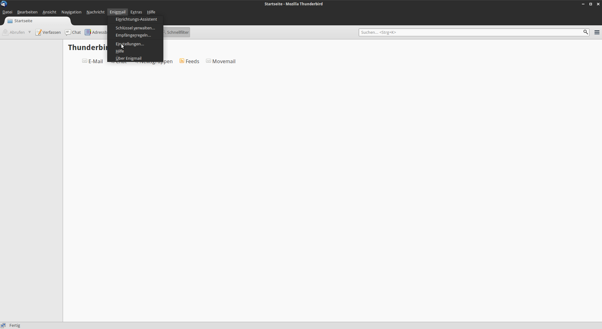
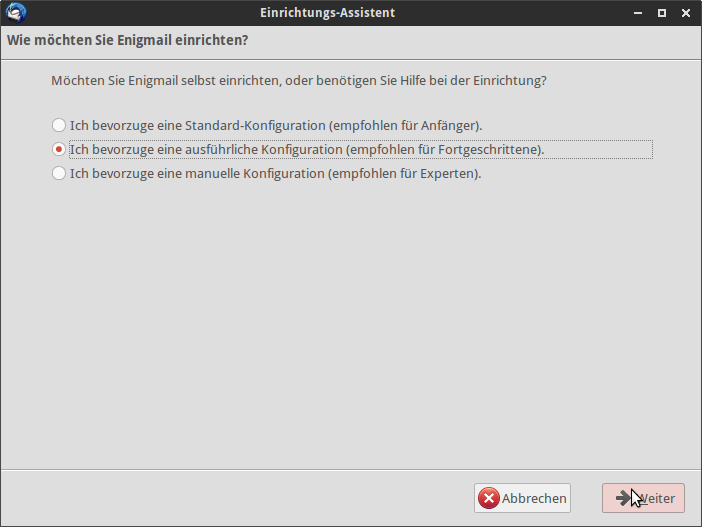
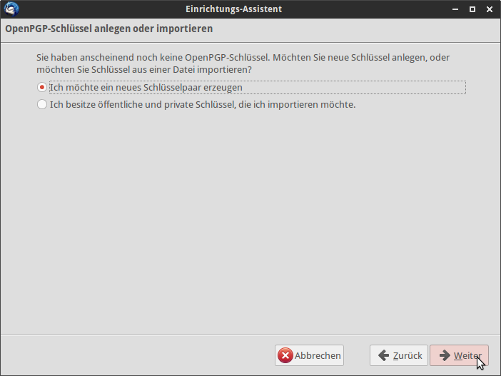
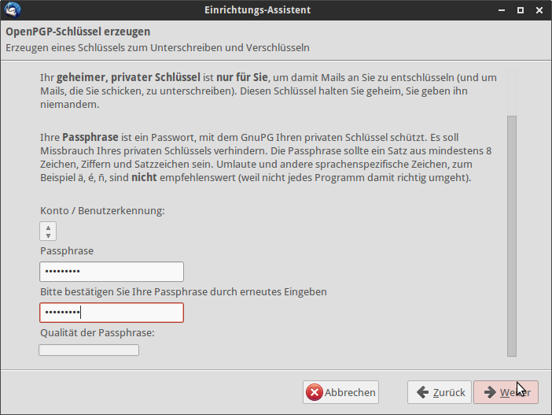
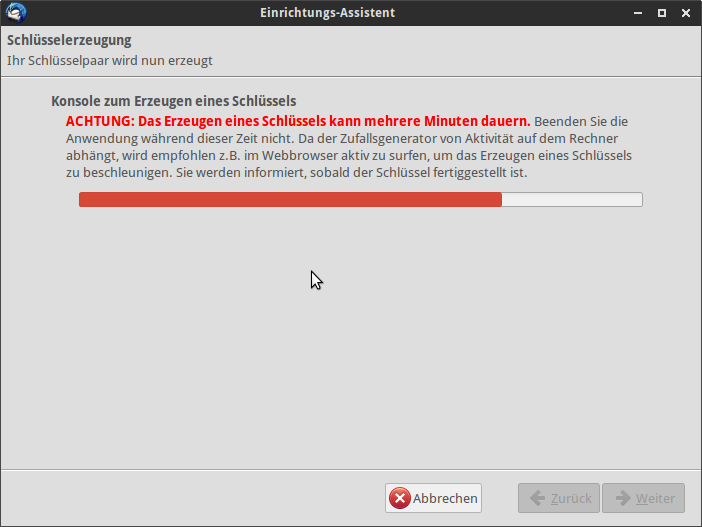
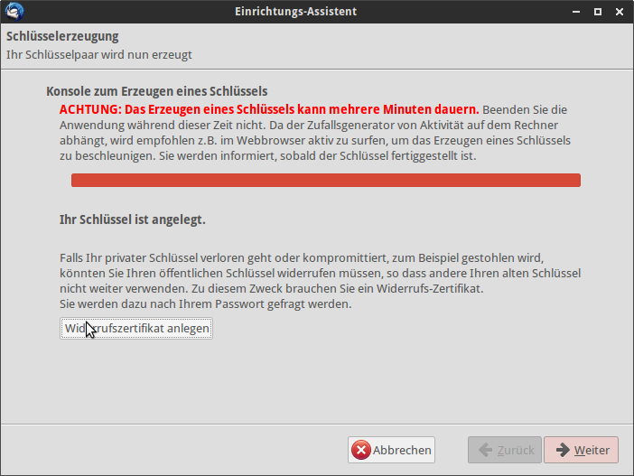
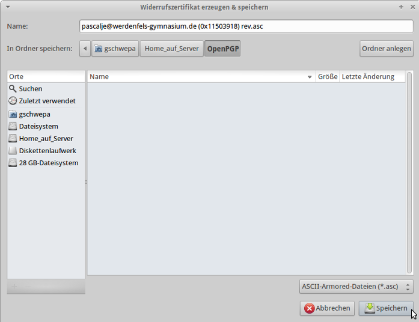
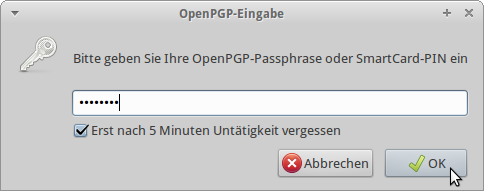

@title Enigmail einrichten
@group thunderbird

1. Öffne `Thunderbird`

2. Klicke auf `Enigmail` und dann auf `Einrichtungs-Assistent`

  

3. Wähle nun `Ich bevorzuge eine ausführliche Konfiguration` aus und klicke auf `Weiter`

  

4. Klicke jetzt auf `Ich möchte ein neues Schlüsselpaar erzeugen` und auf `Weiter`

  

5. Gib ein Passwort ein und klicke auf `Weiter`

  

6. Warte nun einen Moment und klicke ein wenig mit der Maus um dem Zufallsgenerator zu helfen

  

7. Klicke anschließend auf `Widerrufszertifikat anlegen`

  

8. Speichere nun das Schlüsselpaar irgendwo in `Home_auf_Server` ab

  

9. Gib nun das vorher eingerichtete Passwort ein

  

10. Nun ist `Enigmail` erfolgreich eingerichtet