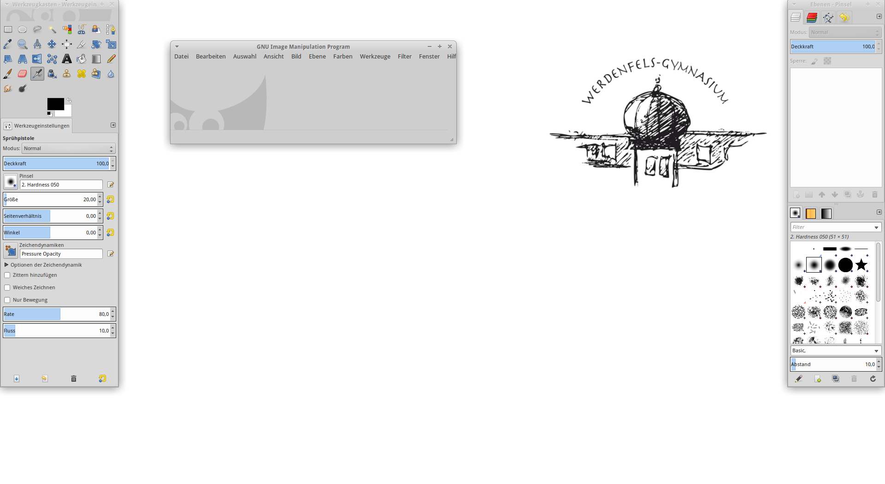
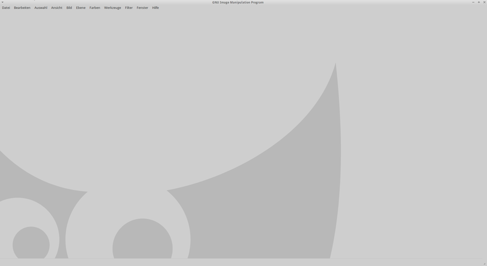
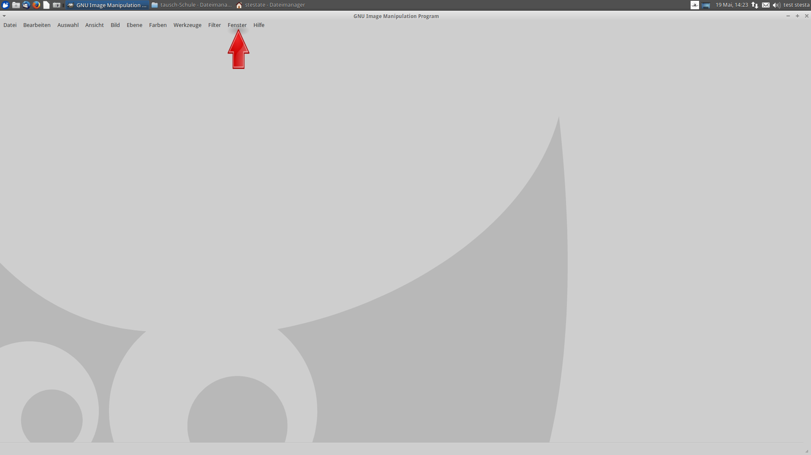
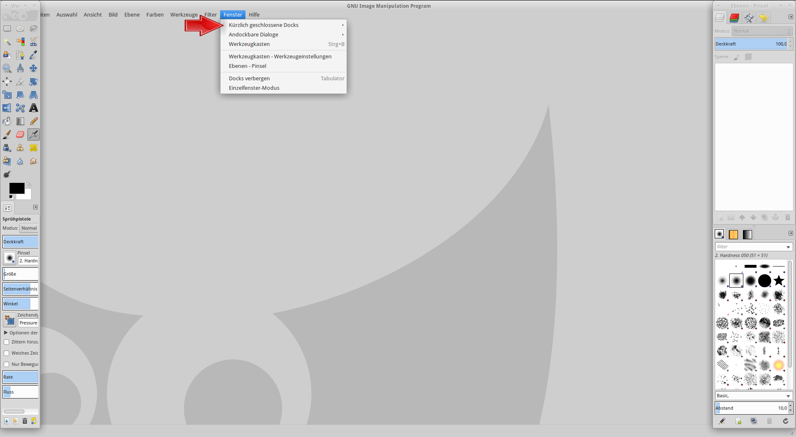
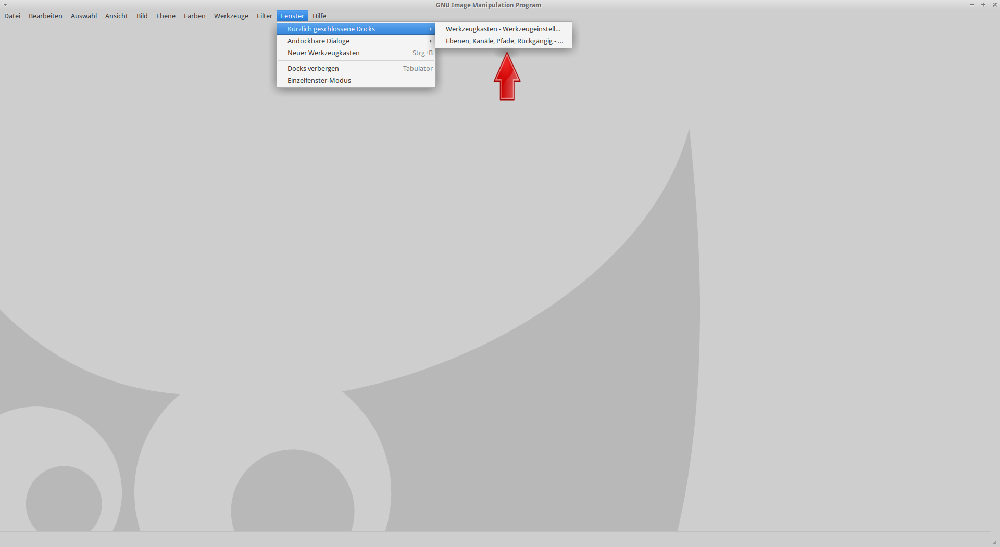
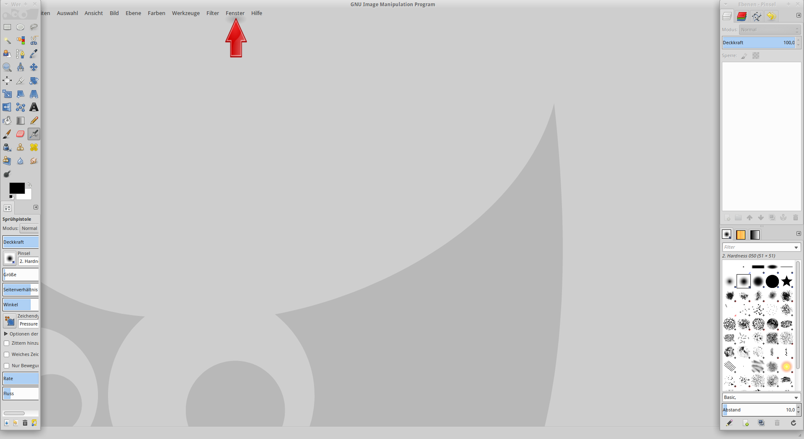
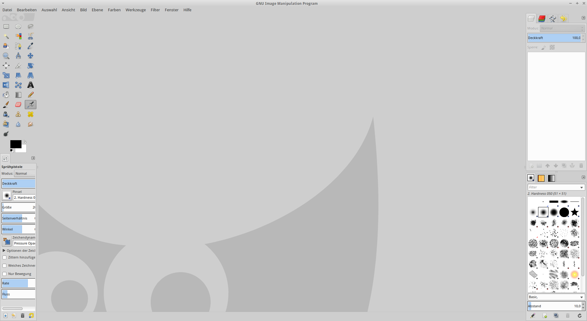

@title Gimp-Toolbar
@group gimp

So öffnet ihr in Gimp geschlossene Docks und verwendet Gimp im Einzelfenster-Modus

1. So sieht Gimp beim starten aus:

 

2. So sieht Gimp <b>ohne<b> Docks aus:

 

 <b>Hinweis<b>: Überprüfen ob du die Docks geschlossen bzw. versteckt hast.
	        Mit der Tabulator-Taste können die Docks versteckt bzw. wieder sichtbar gemacht werden.

3. Klicke auf den Reiter: <b>Fenster<b>

 

4. Klicke nun auf: <b>Kürzlich geschlossene Docks<b>

 

5. Nun siehst du die Docks, welche du kürzlich geschlossenen Docks.
   Klicke auf den Namen des Docks, welchen du wieder öffnen willst.

 

6. Falls nun die Docks offen sind, kannst du Gimp im <b>Einzelfenster-Modus<b> benutzen.
   Klicke dafür auf den Reiter <b>Fenster<b> und klick auf <b>Einzelfenster-Modus<b>.

 

7. Klicke dann auf: <b>Einzelfenster-Modus<b>
   Ist alles problemlos verlaufen, sollte es ungefähr so aussehen:

 
