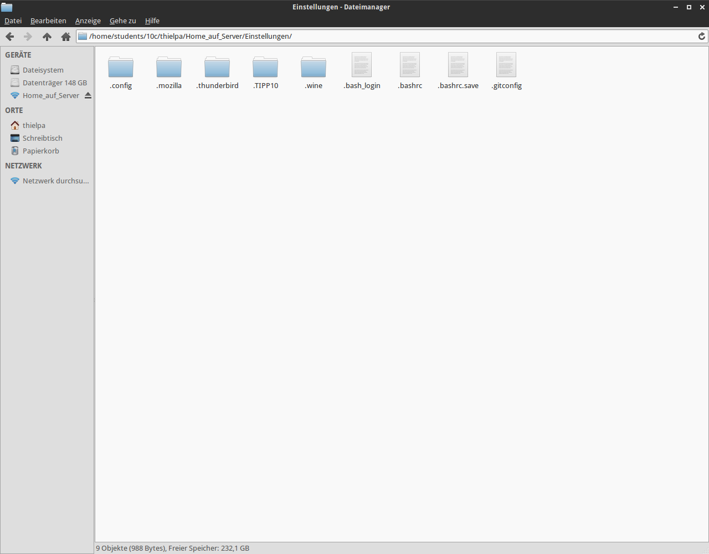

@title Permanente Konfiguration
@group config

1. Deine Git-Konfigurationsdatei findest du beispielsweise in: `~/.gitconfig`

2. Kopiere die Konfigurationsdatei nun nach `/home/students/[Klasse]/[Benutzer]/Home_auf_Server/Einstellungen`

  

3. Jetzt ist diese Konfigurationsdatei permanent (auch nach Wiederanmeldung) gespeichert