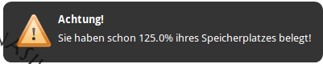
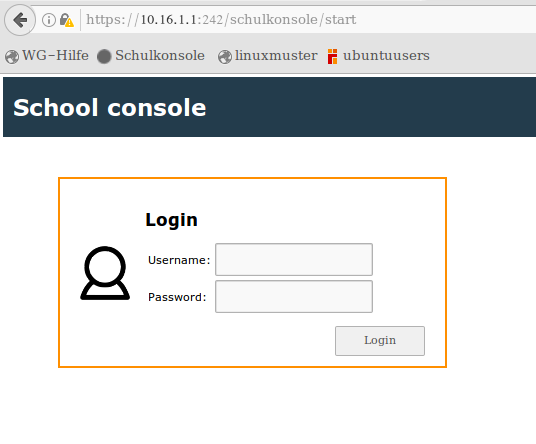
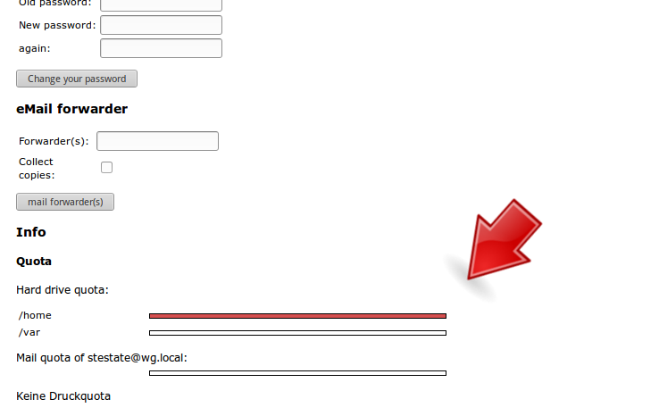
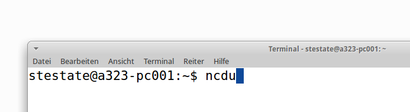
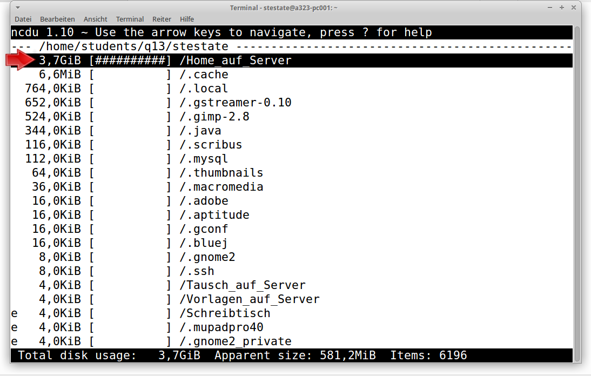

@title Quota-Überschreitung
@group quota

So findet ihr heraus mit welcher Datei(n) das "Quota" überschritten ist

1. Falls folgende Warnmeldung erscheint

   

2. Klicke diesen Link um zur Schulkonsolen-Webseite zu gelangen: https://10.16.1.1:242/schulkonsole/start 

3. Melde dich an

   

4. Überprüfe die Quota-Überschreitung auf der Schulkonsolen-Webseite

   

5. Öffne das Terminal mit der Tastenkombination `STRG + ALT + T`

6. Gib nun den Befehl `ncdu` ein

   

7. Warte bis folgendes zu sehen ist:

   

   Die Dateigröße ist links am Rand zu sehen

8. Nun kann die Datenbank per Pfeiltasten durchstöbert werden

9. Mit der Taste "Enter" kann der ausgewählte Ordner geöffnet werden

10. Nachdem die Datei(n) gefunden wurden, können diese gelöscht werden

<b>Wichtig<b>: Vergiss nicht den Papierkorb zu löschen!
