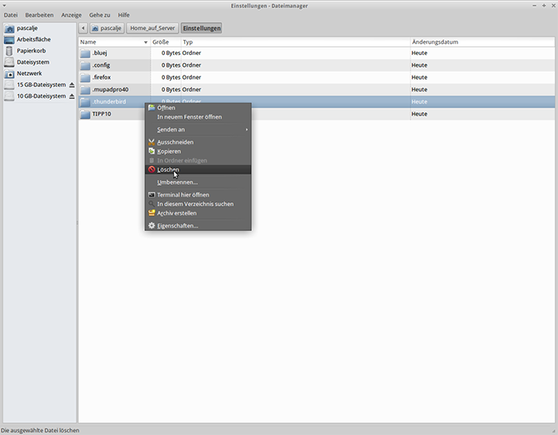

@title Zurücksetzten
@group thunderbird

1. Gehe in das Verzeichnis `Einstellungen` in `Home_auf_Server`

2. Drücke nun die Tasten-Kombination `Strg + H`

3. Lösche jetzt das Verzeichnis `.thunderbird`

  
