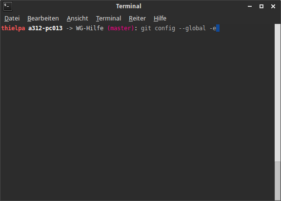
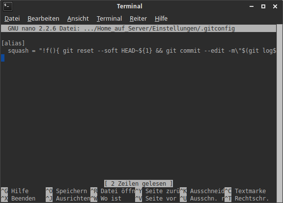
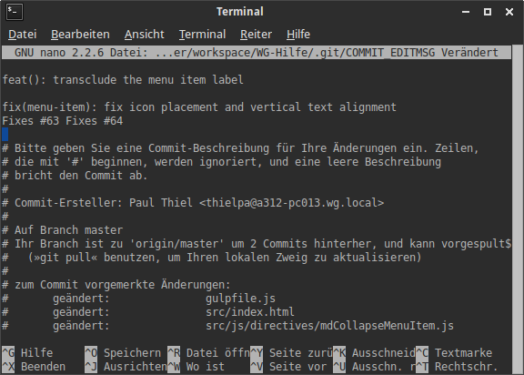
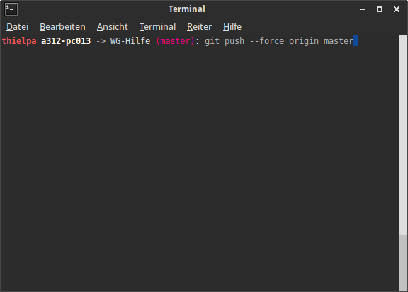

@title Github squashen
@group github

1. Öffne deine Git Konfigurationsdatei (`.gitconfig`) durch die Verwendung von `git config --global -e`

   

2. Füge nun den folgenden Code-Ausschnitt ein.

	```
    [alias]
	squash = "!f(){ git reset --soft HEAD~${1} && git commit --edit -m\"$(git log --format=%B --reverse HEAD..HEAD@{1})\"; };f"
	```

   

3. Speichere nun das Dokument.

   Jetzt kann der Befehl `git squash [Anzahl der Commits]` genutzt werden

   

4. Um den Squash hochzuladen, benutze das Syntax `git push --force [REMOTE] [BRANCH]`

   
