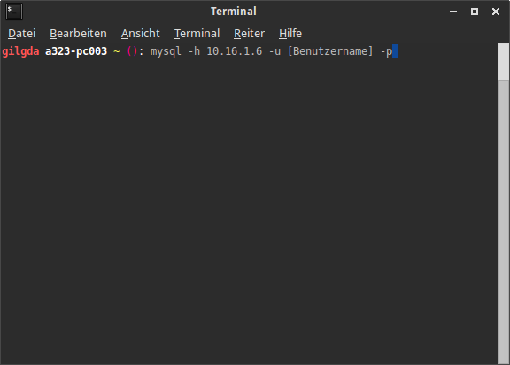
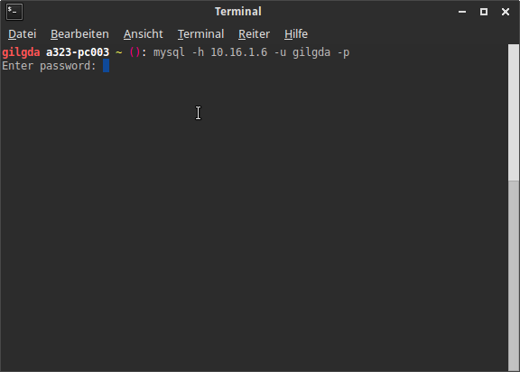

@title MySQL im Terminal
@group mysql

1. Öffne das Terminal mit der Tastenkombination `Strg + Alt + T`

2. Gib nun den Befehl `mysql -h 10.16.1.6 -u [Benutzername] -p` ein

   

3. Jetzt muss das Passwort eingegeben werden
    
   

3. Nun kann die Datenbank wie gewohnt per Kommandozeile bedient werden