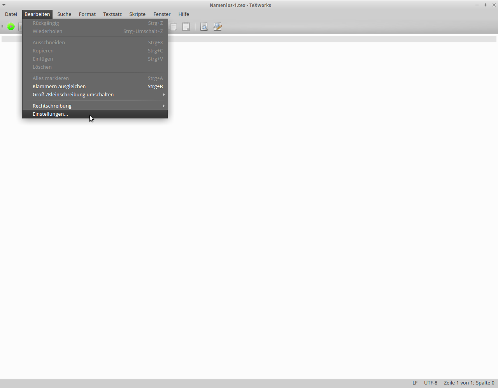
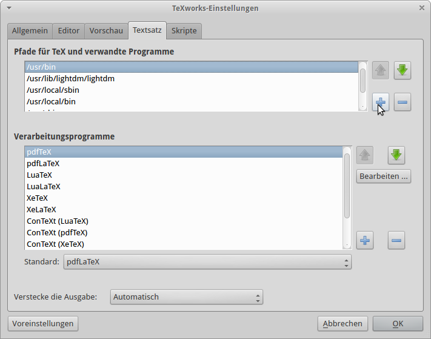
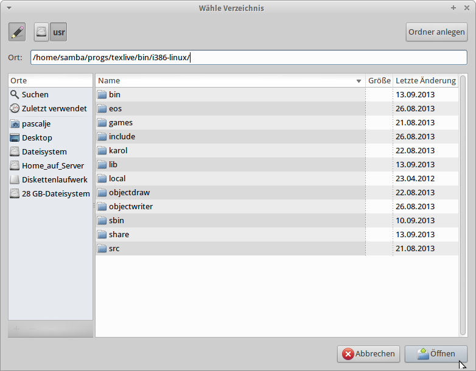
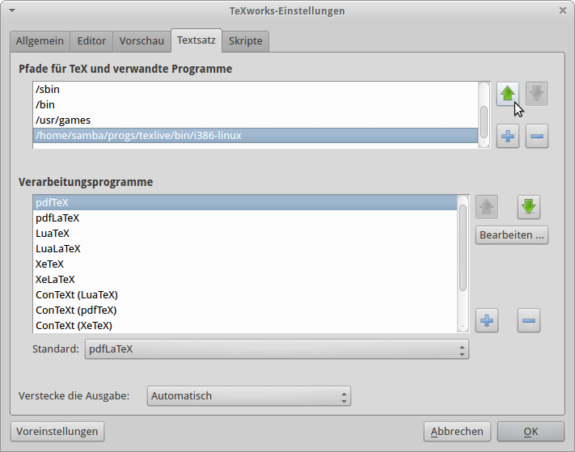

@title Texwork
@group texwork

1. Öffne TeXWorks

2. Klicke auf `Bearbeiten` und dann auf `Einstellungen`

   

3. Klicke nun auf die Kategorie Textsatz

4. Klicke nun auf den grünen Knopf um einen Pfad hinzuzufügen

   

5. Nun öffnet sich ein Fenster, klicke auf den Stift und gib folgenden Pfad ein und klicke auf `Öffnen`: `/home/samba/progs/texlive/bin/i386-linux/`

   

6. Klicke nun so oft wie möglich auf den grünen Pfeil um den Pfad nach oben zu verschieben

   

7. Nun sind die Vorlagen eingebunden
