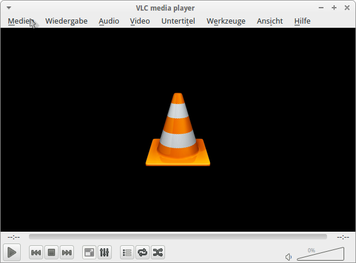
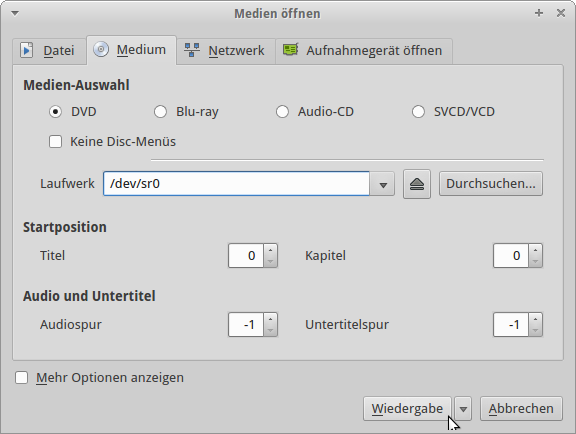

@title VLC Medium abspielen
@group vlc-player

1. Öffne den VLC-Player

2. Klicke dann auf den Reiter `Medien`

  

3. Klicke danach auf `Medium öffnen`

4. Dort muss das Laufwerk auf `/dev/sr0` gesetzt werden

  
